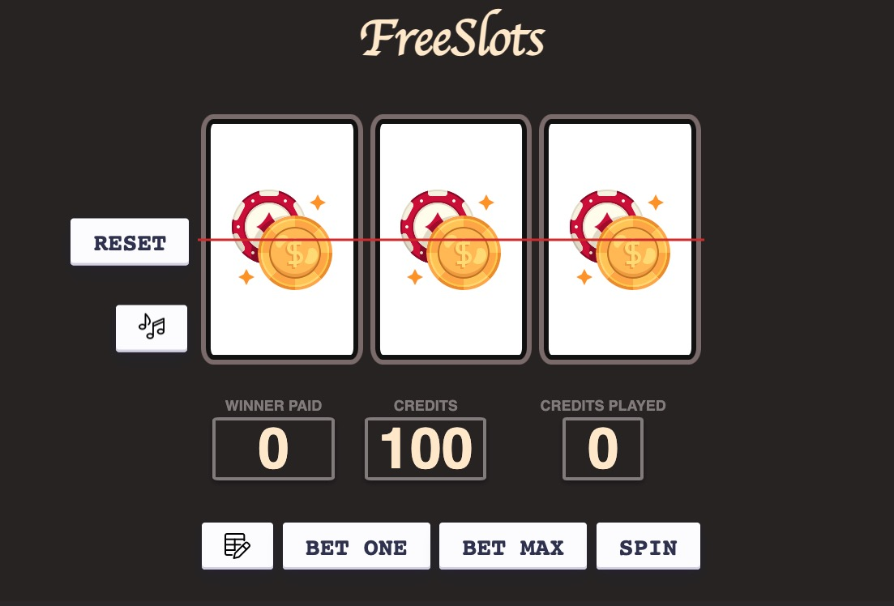
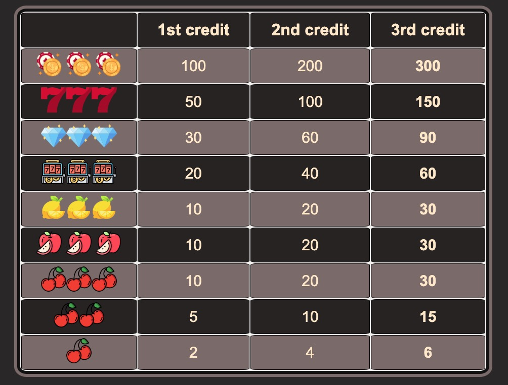

# FreeSlots

A simple, interactive slot machine game where users can bet and try their luck to win the jackpot! Let's [PLAY](https://jennyzhong2022.github.io/Slot-Machine/)

## Features

- **Interactive UI**: A modern and engaging user interface that is easy to navigate.
- **Audio Effects**: Realistic sound effects for an enhanced game-play experience.
- **Flexible Betting Options**: Users can choose how much they want to bet.
- **Randomized Spins**: Every spin is entirely random, ensuring a unique game-play experience every time.

## How to Play

1. Use the `Bet One` button to increase your bet amount, or the `Bet Max` button to bet the maximum allowed credits.
2. Check the payout table on the second page to see possible winnings based on your bet and the combination.
3. Click the `Spin` button and wait for the result. If all three slots match, you win the jackpot!
4. Use the `RESET` button to reset the game.
5. Toggle sound on/off using the sound button.

## Screenshots

## Slot Machine JS Functionality

This JavaScript file is responsible for controlling the slot machine game's functionality. Here's a breakdown of some key functions used in the game:

## Audio Control Functions

- **`audioPlayTime(audioName, currentTime, timeLength)`**: This function controls the playback time of a given audio clip. It allows the clip to play for a specified length before pausing.

- **`stopAudio(audioName, currentTime)`**: A utility function to stop the given audio and reset its playback time.

- **`musicHandler()`**: Toggles the game's audio on or off, and updates the music control icon accordingly.

## Slot Machine Game Functions

- **`init()`**: Initializes the game state, setting up the scores on the UI.

- **`addCreditsPlayed()`**: Increments the number of credits played by the player.

- **`MaxCreditsPlayed()`**: Sets the credits played to the maximum allowed.

- **`spinHandler(resetScoresCallback)`**: The core function for spinning the slot machine. It randomizes the slot values, calculates the player's winnings, and updates the scores.

- **`winnerAndCreditPlayedScoreReset()`**: This function simulates the accumulation of won credits to the player's total. As credits are added one-by-one, an audio cue plays for enhanced user feedback. Concurrently, the 'winnerPaid' score decreases incrementally to match the credits being added. During this process, the spin button is temporarily disabled to ensure smooth score updates. A visual rolling animation gives a lively effect similar to classic slot machines. Once all credits are transferred, the 'winnerPaid' score resets to 0, signaling the end of the payout process.

- **`resetHandler()`**: Resets the entire game state, including all scores and slot images.

- **`musicHandler()`**: Turn the game's audio on or off based on the player's preference. Updates the music control icon in the UI.

- **`tableHandler()`**: Scrolls the user's view to the game's payout table.

## Event Listeners

These are attached to various UI elements like buttons to listen for user interactions:

- **`betOneButton`**: Listens for clicks to bet one credit.
- **`betMaxButton`**: Listens for clicks to bet the maximum allowed credits.
- **`spinButton`**: Activates the slot machine spin.
- ... and more.

## Contributing

Feel free to fork the project and make any contributions. All contributions are welcome!
